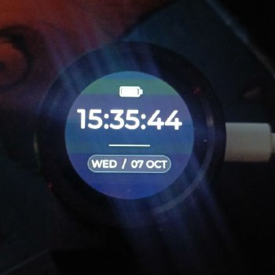
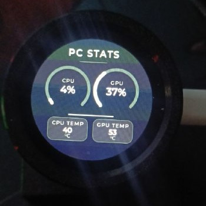
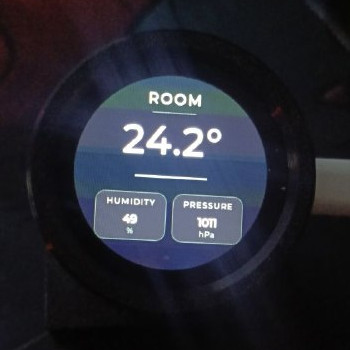
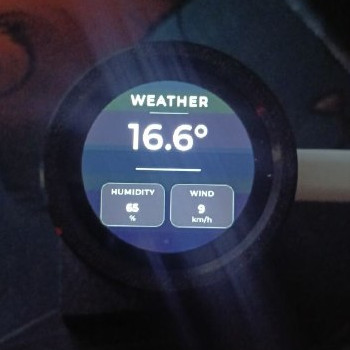
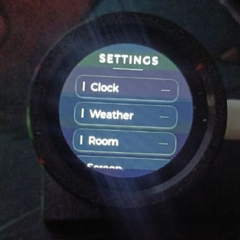
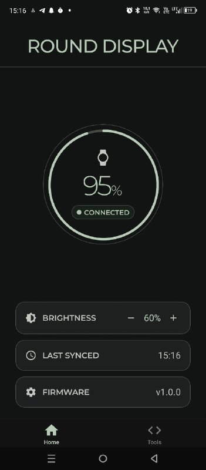

# Round Display

This is a small PC telemetry monitor built with a XIAO ESP32-S3 and a Seeed 240×240 GC9A01 LCD. 

It displays PC stats over USB, gets weather and settings from an Android companion app via BLE, and grabs room temperature, humidity, and pressure from a separate ESP32 sensor node over ESP-NOW.

## Interface

<table>
  <tr>
    <td align="center" width="33%">
      <br />
      <sub><b>Clock</b></sub>
    </td>
    <td align="center" width="33%">
      <br />
      <sub><b>PC Telemetry</b></sub>
    </td>
    <td align="center" width="33%">
      <br />
      <sub><b>Room Data</b></sub>
    </td>
  </tr>
  <tr>
    <td align="center" width="33%">
      <br />
      <sub><b>Weather</b></sub>
    </td>
    <td align="center" width="33%">
      <br />
      <sub><b>Settings</b></sub>
    </td>
    <td align="center" width="33%">
      <br />
      <sub><b>Mobile Companion</b></sub>
    </td>
  </tr>
</table>

> [Watch the hardware demo](assets/videos/demo.mp4)

## Architecture


## Features

- LVGL UI designed for the circular screen
- Touch input and brightness control via the CST816D controller
- 3D printed housing
- Linux daemon that uses `nvidia-smi` to push CPU/GPU stats over USB serial
- React Native Android app (uses native BLE for settings, background weather sync, and status checks)
- PCF8563 RTC keeps time when disconnected
- Battery voltage monitoring via ADC divider
- Wireless room sensor: A separate ESP32 reads temp/humidity/pressure from a DHT11 and BME280, broadcasts via ESP-NOW, then drops into a 120-second deep sleep.

## Repository Structure

```text
├── firmware/
│   ├── data/              # Display assets and fonts
│   ├── src/
│   │   ├── display/       # Main display firmware (PlatformIO)
│   │   └── sensor/        # ESP32 room sensor (PlatformIO)
│   └── platformio.ini
│
├── desktop/               # .NET 9 Linux telemetry service
├── mobile/                # Expo / React Native Android app
│
└── HARDWARE_GUIDE.md      # Pinouts and assembly quirks
```

## Bill of Materials

**Main Display:**
- [Seeed Studio XIAO ESP32-S3](https://www.seeedstudio.com/XIAO-ESP32S3-p-5627.html)
- [Seeed Studio Round Display for XIAO](https://www.seeedstudio.com/Seeed-Studio-Round-Display-for-XIAO-p-5638.html)
- [3D Printed Case](https://www.printables.com/model/1748335-case-for-xiao-round-display)

**Room Sensor Node:**
- Any standard ESP32 board (NodeMCU, WROOM, etc.)
- DHT11 sensor
- BME280 sensor

## Getting Started

### Firmware (PlatformIO)

Build and upload the main display firmware:

```bash
cd firmware
pio run -e display -t upload
```

For the room sensor node:

```bash
pio run -e sensor -t upload
```
*(Check `platformio.ini` if you need to change your upload ports).*

### Desktop Service

You need Linux, the .NET 9 SDK, and `nvidia-smi`.

```bash
cd desktop
dotnet restore
dotnet run
```
The daemon pings the display over serial (`115200` baud) and pushes stats every second. You can set it up as a systemd service to run in the background.

### Mobile App

You can't use Expo Go because of the native BLE modules. Build and run it locally:

```bash
cd mobile
npm install
npm run android
```

## Hardware Notes

Check [HARDWARE_GUIDE.md](HARDWARE_GUIDE.md) before putting this together. A few major quirks to watch out for:
- I2C init order is annoying. The display has to be initialized *before* I2C, and the CST816D touch controller needs a manual reset sequence.
- There's a 2-bit DIP switch on the back of the Seeed board. It must be flipped ON, or the RTC, touch, and battery monitor won't work at all.

## Status & Roadmap

Most of the main features are done:
- [x] Basic UI and LVGL navigation
- [x] PC telemetry over USB
- [x] Android BLE connection and background weather sync
- [x] Room sensor ESP-NOW integration
- [ ] Add more screens (e.g., detailed weather forecast)
- [ ] Implement settings sync from the phone

## License

[MIT License](LICENSE)
